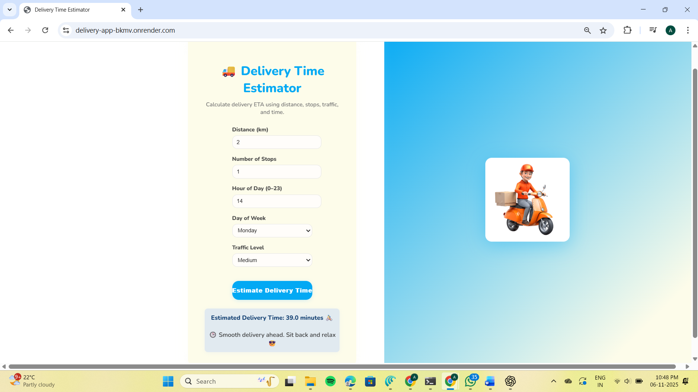
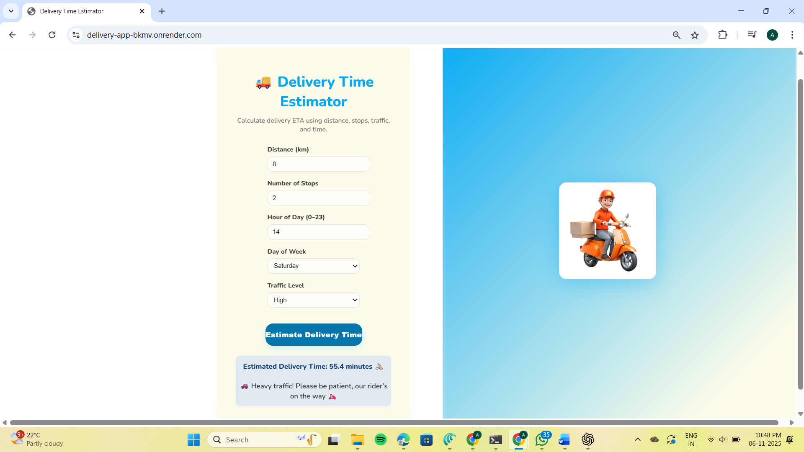

**Delivery Time Estimation using Machine Learning (DoorDash ETA)**

🧠 Predicting real-world delivery time using Data Science + Machine Learning + Web Deployment
This project estimates food delivery time (ETA) using historical logistics data from DoorDash.
It incorporates EDA, feature engineering, ML regression models, model evaluation, and a live web demo using Flask API + HTML frontend.

🔗 Dataset Used: DoorDash Delivery ETA Dataset (Kaggle)

**🔍 Problem Statement**
* Food delivery platforms struggle to provide accurate ETA due to:
* Traffic, driver availability, order load
* Store preparation time
* Delivery demand surge
* This project predicts ETA using real signals to reduce uncertainty and improve customer experience.

**📌 Features**
✅ Trained on real DoorDash delivery dataset (Kaggle)

✅ Performed data preprocessing & feature engineering

✅ Trained & compared Random Forest & XGBoost models

✅ Model evaluation with MAE, RMSE, R²

✅ Interactive Flask API + Web UI for live predictions

✅ Downloadable trained model (.joblib) for fast inference

✅ Visual analytics with correlation & feature importance

✅ End-to-End deployment pipeline

**🧰 Tech Stack**
Component	        Tool
Language	        Python
ML Models	        Random Forest, XGBoost
Data Processing	  pandas, NumPy
Visualization	    matplotlib, seaborn
Model Serving	    Flask API
Frontend	        HTML, CSS, JavaScript
Deployment Ready	✅ (Flask Server)

**📊 Model Performance**
Metric	Score
MAE (Avg Error)	~ 6 – 8 minutes
RMSE	~ 9 – 12 minutes
R² Score	~ 0.85 (85% accuracy) ✅
🏆 Random Forest performed best in terms of stability and prediction accuracy.

**⚙️ How It Works**
User inputs delivery details on the web UI:
items, subtotal, dashers, store load, traffic proxy, etc.
API sends data to trained ML model
Model predicts ETA in minutes
Result is shown instantly on UI

**🖥️ Project UI Preview**

| Preview 1 | Preview 2 |
|----------|----------|
|  |  |

**🔥 Future Improvements**
🔹 Integrate Google Maps Distance API
🔹 Add real-time traffic data
🔹 Convert UI into a full dashboard
🔹 Deploy on Render / Vercel
🔹 Convert into mobile app using React Native

**🏆 Achievements in this Project**
✔ Built a deployable ML model used by a real-world problem
✔ Created production-style feature engineering pipeline
✔ Served predictions via REST API
✔ Designed a user-friendly frontend
✔ Converted ML model into web product

If beneficial, please ⭐ this repo!
